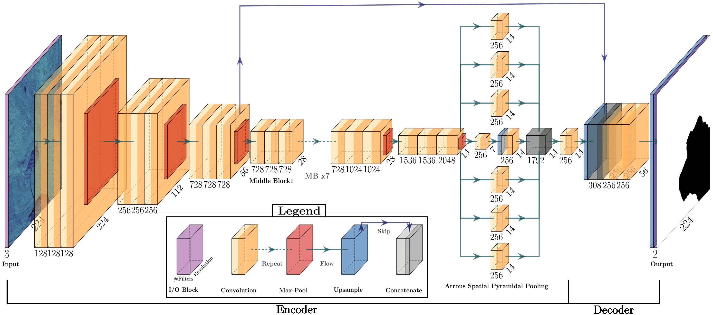

# CALFIN
[](https://github.com/yaramohajerani/FrontLearning/blob/master/LICENSE)
[](https://zenodo.org/badge/latestdoi/185285507)

Calving Front Machine. Automated detection of glacial positions, using neural networks.

## Introduction
This is the official codebase for [Calving Front Machine (CALFIN): an Automated Deep Learning Glacial Terminus Extraction Method [1]](#References). 
We provide an automated pipeline using a modified DeepLabV3+ with Xception neural network. 
The mean distance error is 2.25 pixels (86.76 meters) from the true front on a diverse set of 162 validation images.

The method is used to generate the CALFIN dataset, consisting of 22,678 total calving fronts spanning 66 Greenlandic basins, from Sept. 1972 - June 2019.
[The CALFIN dataset can be downloaded at DataDryad [2]](https://doi.org/10.7280/D1FH5D).



## Running CALFIN
The CALFIN codebase allows for execution of the automated pipeline on new data, as well as the training of the CALFIN neural network on new data.
To continue, select the desired section(s) from the table of contents below.

### Installation
1. Download the repository with `git clone https://github.com/daniel-cheng/CALFIN`.
2. Install dependencies using [Anaconda package manager](https://www.anaconda.com/products/individual#Downloads) with `conda env create -f training/dependencies/environment_<os>_cfm.yaml`, selecting your OS, or `base` otherwise. If performing Shapefile postprocessing, also install `environment_<os>_rasterio.yaml` similarly in a second environment, to avoid package conflicts.
4. Download the trained network weights from [DataDryad](https://doi.org/10.7280/D1FH5D) or the [v1.0.0 Release](https://github.com/daniel-cheng/CALFIN/releases/tag/v1.0.0) and extract them to `training/cfm_weights_patched_dual_wide_x65_224_e17_iou0.5236.h5`.
3. Run CALFIN in a Python console such as Spyder, or on the command line by prepending `python ` before the path to each script. Modify script parameters as required.

### Preprocessing
1. Create a square Shapefile polygon in the projection of your source imagery in [`preprocessing/domains`](https://github.com/daniel-cheng/CALFIN/tree/master/preprocessing/domains).
2. Subset all source images, by loading them in [QGIS](https://www.qgis.org/en/site/) with [`bulk_add_rasters`](https://github.com/daniel-cheng/CALFIN/tree/master/preprocessing/bulk_add_rasters.py) and executing the [`bulk_subsetter`](https://github.com/daniel-cheng/CALFIN/tree/master/preprocessing/bulk_subsetter.py).
3. Optionally, enhance the subsets, either using the [HDR/Shadows & Highlights Adobe Photoshop CS6 presets](https://github.com/daniel-cheng/CALFIN/tree/master/preprocessing/Adobe%20Photoshop%20CC%202018), or other contrast enhancements.
4. Use the [`bulk_layerer`](https://github.com/daniel-cheng/CALFIN/tree/master/preprocessing/bulk_layerer.py) to combine grayscale subsets into RGB input images in `processing/landsat_raw_processed`.

### Processing
1. Execute [`run_production.py`](https://github.com/daniel-cheng/CALFIN/blob/master/postprocessing/run_production.py). Results will be generated in `outputs/production`.

### Postprocessing
1. Optionally, verify the results of `outputs/production/quality_assurance/<domain>`, and copy any `*overlay_front.png` files that are incorrect to the corresponding `outputs/production/quality_assurance_bad/<domain>` folder to eliminate it from the final output.
2. Finally, switch to the rasterio environment to avoid pacakge conflicts, and run the [`postprocessing/bulk_shapefile_polygonizer.py`](https://github.com/daniel-cheng/CALFIN/tree/master/postprocessing/bulk_shapefile_polygonizer.py), then the [`postprocessing/bulk_shapefile_consolidator.py`](https://github.com/daniel-cheng/CALFIN/tree/master/postprocessing/bulk_shapefile_consolidator.py) to create the final outputs in `outputs/upload_production/v1.0/level-1_shapefiles-domain-termini`.

## Training
1. Prepare preprocessed data by running [`training/data_cfm_patched_dual.py`](https://github.com/daniel-cheng/CALFIN/tree/master/training/data_cfm_patched_dual.py). This will generate optimized validation/training processing during training.
2. Optionally, modify the data augmentation routines in [`training/aug_generators_dual.py`](https://github.com/daniel-cheng/CALFIN/tree/master/training/aug_generators_dual.py), or the neural network architecture in [`training/model_cfm_dual_wide_x65.py`](https://github.com/daniel-cheng/CALFIN/tree/master/training/model_cfm_dual_wide_x65.py).
3. Run [`training/train_cfm_v11_224_deeplabv3-xception_patched-256-16.py`](https://github.com/daniel-cheng/CALFIN/tree/master/training/train_cfm_v11_224_deeplabv3-xception_patched-256-16.py).

## Testing
1. To reproduce the validation results in [our study [1]](#References), execute [`postprocessing/run_calfin_on_calfin.py`](https://github.com/daniel-cheng/CALFIN/blob/master/postprocessing/run_calfin_on_calfin.py), [`postprocessing/run_calfin_on_mohajerani.py`](https://github.com/daniel-cheng/CALFIN/blob/master/postprocessing/run_calfin_on_mohajerani.py), [`postprocessing/run_calfin_on_zhang.py`](https://github.com/daniel-cheng/CALFIN/blob/master/postprocessing/run_calfin_on_zhang.py), and [`postprocessing/run_calfin_on_baumhoer.py`](https://github.com/daniel-cheng/CALFIN/blob/master/postprocessing/run_calfin_on_baumhoer.py).

## Running CALFIN on New Domains
If you plan to use CALFIN on a domain outside of the existing set, be familiar with the training set and the set of conditions CALFIN can handle (see [[1]](##References)). CALFIN was trained using Landsat (optical) and Sentinel-1 (SAR) data. The training set includes 1600+ Greenlandic glaciers and 200+ Antarctic glaciers/ice shelves. CALFIN can handle ice tongues, branching, Landsat 7 Scanline Corrector Errors, sea ice, shadows, and light cloud cover. 

CALFIN requires a fjord boundaries mask in order to function - these must be created manually, then geolocated as a GeoTiff to enable Shapefile outputs. Optionally, create fjord boundary overrides to enforce static fronts not captured in the fjrod boundary mask or in CALFIN output. See also [`training/data/fjord_boundaries`](https://github.com/daniel-cheng/CALFIN/tree/master/training/data/fjord_boundaries), [`training/data/fjord_boundaries_tif`](https://github.com/daniel-cheng/CALFIN/tree/master/training/data/fjord_boundaries), and [`preprocessing/bulk_png_to_geotiff.py`](https://github.com/daniel-cheng/CALFIN/tree/master/preprocessing/bulk_png_to_geotiff.py).

## Citation
If you find this code helpful, please cite as below:
````
@article{ChengHLMWVR2020,
	title={Calving Front Machine (CALFIN): Glacial Termini Dataset and 
			Automated Deep Learning Extraction Method for Greenland, 1972-2019},
	author={Daniel Cheng and Wayne Hayes and Eric Larour and Yara Mohajerani and 
			Michael Wood and Isabella Velicogna and Eric Rignot},
	journal={The Cryosphere Discussions},
	year={2020}
}

@dataset{ChengHL2020,
	title={CALFIN: Calving Front Dataset for East/West Greenland, 1972-2019},
	author={Daniel Cheng and Wayne Hayes and Eric Larour},
	journal={The Cryosphere Discussions},
	url={https://doi.org/10.7280/D1FH5D}
	year={2020}
}
````

## References
[1] Calving Front Machine (CALFIN): Glacial Termini Dataset and Automated Deep Learning Extraction Method for Greenland, 1972-2019. Daniel Cheng, Wayne Hayes, Eric Larour, Yara Mohajerani, 
		   Michael Wood, Isabella Velicogna and Eric Rignot. Accepted for review in The Cryosphere Discussions.

[2] CALFIN: Calving Front Dataset for East/West Greenland, 1972-2019. Daniel Cheng, Wayne Hayes, and Eric Larour. 

## Acknowledgements
This work was conducted as a collaboration between NASA’s Jet Propulsion Laboratory and the University of California, Irvine.

The CALFIN neural network architecture implementation is derived from [Emil Zakirov’s Deeplabv3+ Xception codebase](github.com/bonlime/keras-deeplab-v3-plus). 

We acknowledge the USGS for providing Landsat-1-8 images, the ESA for their Sentinel-1 images, as well as the ESA-CCI, PROMICE, and MEaSUREs programs for providing calving front data used in this study.

## Contact
For questions, contact [dlcheng@uci.edu](mailto:dlcheng@uci.edu).
